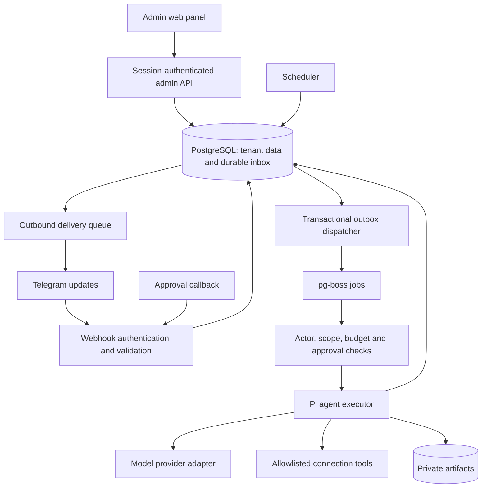

# Architecture

Status: initial scaffold implemented; production design proposed, 2026-09-18.

## Current repository

The implemented scaffold exports a Hono app from `src/index.ts` and starts it through
`src/server.ts` using the Node adapter. `GET /healthz` reports liveness, `GET /`
identifies the scaffold and unknown routes return JSON 404. There is no authenticated
webhook, database, Pi runtime or admin UI yet.

Bun manages dependencies/builds/tests; Node 24 runs the Docker image. TypeScript is
strict and Biome handles linting/formatting. The Dockerfile has separate dependency,
build and non-root runtime stages. Compose currently starts only the HTTP app.

The selected production design adds a React Router 7 admin SPA served by Hono under
`/admin`, a same-origin admin API, Pi in a worker process, and PostgreSQL for state
and durable jobs. A separate web server is unnecessary. Keep the standalone repo;
add `web/` for the frontend and shared API contracts when implementation begins.
See [the implementation plan](../implementation/bot-plan.md) for scope and order.

## Proposed production flow

This diagram describes planned components, not provisioned resources.

### Runtime responsibilities

- **Ingress:** authenticate Telegram, enforce payload limits, normalize update
  variants, authorize chat bindings and persist one accepted event.
- **Domain:** workspaces, actors, permissions, workflow definitions, approvals,
  instructions and budget decisions. Keep these independent of Telegram transport.
- **Scheduler:** find due occurrences, claim each once, recheck active status and
  dispatch through the same durable path as interactive work.
- **Orchestrator:** execute bounded tasks with explicit state transitions; stop on
  missing information/permission/budget; never infer tool authorization from prose.
- **Tool adapters:** small typed operations with deterministic scope checks, secret
  references and auditable outcomes. P0 has no external write operations.
- **Delivery:** preserve chat/topic context, enforce rates, format results and track
  message IDs independently from model completion.
- **Retention:** revoke access immediately and delete raw/derived/provider-held
  data through separately tracked jobs.

## Proposed infrastructure choices

Use PostgreSQL for application state and pg-boss for jobs. Enqueue jobs in the same
transaction as accepted input where supported by the pinned adapter; otherwise use
a transactional outbox. API and worker run as separate Docker Compose services from
the same image. The worker owns model execution, job recovery and scheduler ticks.

Pi supplies the agent loop and model-provider abstraction. Application services own
persistence, permissions, approval state, costs, scheduling and Telegram delivery.
Use one Agent per active conversation execution, restore valid persisted context,
and checkpoint completed messages/tool results. No global shared Agent state.

The admin SPA calls `/api/admin/*` and uses the same domain services as bot commands.
Use first-run local-admin creation, optional verified Telegram login/linking,
server-side sessions, tenant roles, CSRF controls and
optimistic version checks. Global bot credentials belong to deployment operators;
workspace admins configure behavior without gaining access to other workspaces.

The HTTPS reverse proxy terminates TLS; only the app is exposed. PostgreSQL remains
private with persistent storage and tested backups. Add file storage when file
features ship. Cloudflare services are no longer part of our deployment architecture.

## Proposed domain records

| Record | Essential fields / invariants |
| --- | --- |
| Workspace | ID, name, timezone, status, policy version; tenant boundary |
| AdminAccount / AdminSession | Local password hash or verified Telegram identity linkage, role, hashed session ID, expiry, revocation state |
| DeploymentSetup | Single deployment claim, bootstrap token hash/expiry, completed steps, activation status |
| Credential | Encrypted bot/provider secret, key version, owner/scope and redacted status |
| Skill / SkillVersion / SkillAssignment | Scoped catalog, immutable instructions/settings schema, pinned enablement and tool ceiling |
| BotConfigVersion | Workspace, validated behavior/model settings, version, author, effective time |
| Member | Workspace + Telegram user ID, role, membership status |
| AccessPolicy / AllowedUser | Workspace access mode and version; unique workspace/user ID entries with audit provenance |
| ChatBinding | Workspace, Telegram chat ID, topic policy, visibility mode, linked-by; unique active binding |
| IncomingEvent | Bot identity + update ID, tenant, accepted time, processing status; unique delivery key |
| MessageContext | Workspace/chat/topic/message ID, author, content reference, received time, expiry |
| Workflow | Owner, task, version, source scope, destination, recurrence, timezone, budget, state |
| ScheduleOccurrence | Workflow/version, scheduled instant, claim status; unique occurrence key |
| Run | Actor, workflow version, status, source snapshot references, timestamps, usage, error code |
| Approval | Exact action hash, authorized actor, expiry, decision, consumed status |
| Instruction/Memory | Scope, content, author, provenance, version, expiry, deletion state |
| Connection | Owner, provider, encrypted credential reference, scopes, sharing policy, revoked-at |
| Artifact | Tenant, run, type, private storage key, audience, expiry |
| UsageLedger | Run, provider, model, measured/estimated units, cost basis, reservation/reconciliation |
| AuditEvent | Tenant, actor, action, target/version, timestamp, outcome; no raw chat payload |
| Outbox/Delivery | Logical event key, destination, attempt count, next retry, remote message IDs |

These records are an implementation guide, not a migration schema. Choose transaction
boundaries and indexing with the first persistent workflow rather than generating
empty tables for every planned feature now.

## Isolation and authorization

All retrieval begins with tenant and audience filters, before model context is built.
The [allowed-user policy](access-control.md) is checked alongside membership and roles
at entry, execution and delivery boundaries; workers must observe revocations.
Scheduled execution has a recorded actor; leaving the workspace or revoking a
connection suspends dependent work. A team-owned run does not impersonate an absent
member. Bot visibility, requester visibility and destination audience are distinct.

Approvals authorize an exact bounded operation or workflow version. A model can
propose a change but cannot edit its policy, mark approval complete, grant tool
access or silently promote private memory to team scope. External content cannot
change the instruction hierarchy.

## Reliability and idempotency

Deduplicate inbound events, workflow occurrences and external effects separately.
At-least-once queues are acceptable if handlers claim/record logical work durably.
Exactly-once external delivery is not assumed: a timeout after a remote send can be
ambiguous. Record attempts, use provider idempotency keys where available, and expose
uncertain outcomes instead of blindly repeating writes.

Capture source coverage and workflow version for reproducibility. Cancellation
blocks future steps but cannot undo completed external actions. Budget reservation
must be atomic across concurrent runs. A cleanup job must respect deletion tombstones
so retried work cannot recreate removed data.

## Validation strategy

Current tests cover local HTTP behavior and ensure an unimplemented webhook does not
acknowledge events. Future domain tests use fixed times and fake adapters. Integration
tests cover durable acceptance, retry/crash boundaries, schedule/DST behavior,
permission revocation, stale callbacks, retention and ambiguous delivery. Before a
pilot, validate in a dedicated Telegram test bot/group with authorized credentials.
