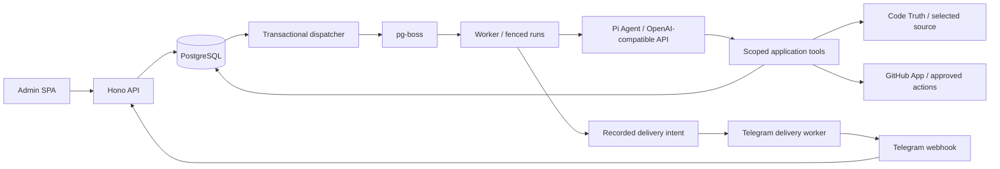

# Architecture

Status: local pilot implementation, 2026-09-18. Live staging validation is pending.

The main product path is Telegram request → workspace and repository authorization
→ AI with scoped GitHub source/action tools → answer or human-reviewed proposal →
GitHub result in the originating chat. See the
[GitHub journey](github-workflows.md) for capability status and policy boundaries.
The existing recap and scheduling services remain supporting paths.

## Runtime

One Docker image contains the Hono API, React Router admin assets, and Pi worker.
Compose runs `app`, `worker`, a one-shot `migrate` service, and PostgreSQL 17.
Only the API port is exposed, on loopback; production HTTPS terminates at the host proxy.
Bun manages packages/builds/tests. Node 24 runs the application.

Model delivery intents explicitly select Markdown formatting. The `marked` lexer
parses model output; a bounded renderer produces plain text with Telegram UTF-16
message entities, preserving code and literal HTML without using a parse mode.
This dependency handles Markdown nesting and escapes instead of regex replacements.
Control messages remain plain text except group-link instructions, which render
the complete `/link TOKEN` command as inline code for copying. Formatting does not alter delivery retries or
the handling of unknown send outcomes.

Model replies use Bot API **10.3** `sendRichMessage` in private chats, groups and
scheduled deliveries. A bounded Markdown lexer maps headings, paragraphs, ordered
and task lists, quotes, fenced code, dividers, tables and safe inline styles into
explicit `InputRichBlock` structures. Tables use native compact cells/alignment.
Untrusted HTML, media and button syntax stay literal; only application code creates
controls. Existing reply length bounds remain. Control/status messages keep their
existing text transport. A confirmed rich-send rejection falls back to text through
the same durable intent; ambiguous sends still require reconciliation.

Requests no longer create a separate queued acknowledgement. Private interactive
runs start with Telegram's native thinking placeholder (`sendMessageDraft` with
empty text), then emit awaited Pi previews through `sendRichMessageDraft` using
the same draft ID. The first text is sent without waiting for the placeholder's
throttle interval. A final durable send persists the answer, as required by Telegram.
The run claim persists a random nonzero draft ID, bot ID and execution fence before
any request. Each execution gets a fresh ID. Updates are limited to one per second,
with a two-second HTTP timeout, cancellation and fenced permission checks before
sending. Bot credential rotation disables previews for that execution. Source
validation applies to previews; incomplete or not-yet-valid citations are withheld.
Only assistant text is exposed, never thinking or tool arguments. No background
preview tasks can outlive the run or race final delivery. Draft errors are best-effort;
429 retry delays are honored. Transient/unknown draft failures can retry the latest
text after one second under the same draft ID, stopping after three consecutive
failures. This applies only to ephemeral previews; unknown final sends never replay.
First draft acceptance and failures emit fixed, sanitized runtime events.
Groups and scheduled runs receive only final replies. Final answers do not append
raw coverage metadata or run IDs; those remain in persisted run records and the
admin panel. Relevant context gaps are explained naturally in the model response.

Drafts set `can_stop:true` and `keep_on_stop:false`. Both polling and webhook
subscriptions request `stopped_message_generation`. The authenticated ingress
transaction deduplicates the event and resolves the workspace by its persisted
bot/private-chat/topic/draft binding, independent of the current workspace selection.
The locked run must match the execution fence and eligible actor; ambiguous matches
are ignored. Stop uses normal run cancellation, even while deployment/workspace
execution is paused. It also cancels a completed-but-pending final reply. A late
click after confirmed/unknown delivery cannot retract or replay it. The worker's
one-second guard aborts generation, prevents further tool dispatch and final
publication, and retains unknown provider reservations. In-flight external calls
cannot be undone. Drafts expire after 30 seconds; partial responses are not saved
automatically. `/cancel` remains available. The optional run metadata needs no SQL
migration; pre-upgrade drafts without a persisted binding cannot be matched.

`TELEGRAM_TRANSPORT` defaults to `webhook`. In opt-in `polling` mode the worker uses
Telegram `getUpdates` and passes validated updates to the same `Ingress` service.
The HTTP webhook endpoint and registration action are disabled in polling mode.
A per-bot PostgreSQL session advisory lock spans each HTTP poll and acceptance batch;
`telegram_polling` stores cursor, credential fingerprint, readiness and retry metadata.
The cursor advances only after durable ingress commits, so crashes can replay safely.
Polling runs before activation to establish receiver readiness, without enabling ordinary agent
work. A recent polling success replaces webhook readiness in activation checks;
model and skill checks remain. Owner linking can happen after activation, while
an empty membership and whitelist deny bot use. Existing webhooks are reported as a
conflict, never silently deleted.

## Persistence and transaction boundaries

`migrations/` owns versioned SQL. A migration advisory lock serializes upgrades.
pg-boss schema creation runs only in the migration entry point; runtime clients
set `migrate:false`. The app and worker never race schema installation.

Workspace records are typed JSONB **aggregates**, updated under `SELECT FOR UPDATE`.
Membership, policy, runs, instructions, approvals, workflows, skill versions,
occurrences, usage attempts, deliveries and audit events belong to that tenant row.
This is an intentional pilot implementation choice instead of a table for each
nested record. Short workspace mutations serialize; provider/Telegram calls execute
outside these locks. API and worker use the same repository and policy services.

Relational tables cover deployment/configuration, local admins/sessions, first-run
claim state, chat bindings, Telegram workspace selections, inbox, outbox, authentication
limits, worker heartbeats, fixed access-help deliveries and operator audit.
Database primary/unique constraints enforce one deployment, one account identity,
one active group binding per workspace/chat and one `(bot_id, update_id)` receipt.
Workflow occurrence uniqueness and conversation leases are enforced while holding
the exclusive tenant row lock. The fencing counter prevents expired executors from
writing after a new claim.

Inbox insertion, domain changes and outbox intents commit together. The dispatcher
locks pending outbox rows and uses pg-boss's `db.executeSql` adapter with the **same
PostgreSQL connection** to enqueue and acknowledge atomically. Jobs carry IDs only,
not user messages. Integration tests verify duplicate acceptance, rollback and
concurrent dispatch with real PostgreSQL.

Pilot capacity: 2,000 retained source messages, 20 pending/running requests and
1,000 retained run/accounting records per workspace. Source retention is 1–90 days;
content is erased independently of the minimal 90-day usage ledger. Unknown charges
remain reserved. This aggregate design is for small pilots; split runs/messages into
indexed tenant tables before raising capacity or running large teams.

## Identity and policy

The local operator configures the deployment, creates accounts and issues recovery
links. It is not a Telegram actor. A one-use private bot interaction verifies the
Telegram identity, consumes its token, enrolls the first owner, seeds the whitelist
and invalidates old browser sessions.

Workspace actions require active membership, allowed-user eligibility, role and
source/destination checks. Group linking additionally calls Telegram `getChatMember`
and requires attributable administrator identity. Anonymous admin senders are denied.
Private sources/memory are excluded from group context. Queued runs, tool calls,
model reservations and deliveries recheck current policy. No model input can change
permissions. Fixed onboarding/access-help replies contain no workspace data.

Admin sessions are hashed, server-side, eight-hour, revocable cookies with CSRF and
exact-origin checks. Passwords use salted Node scrypt. AES-256-GCM uses name-bound
associated data for write-only bot/model/webhook credentials. Responses and audit
records never contain credential values. Optional Telegram web login is not enabled;
verified linking plus local account login is the implemented path.

## Agent and recovery

`AgentRunner` receives bound actor/run identity, model, context, tools, budgets and
cancellation; returns output/status and emits awaited durable checkpoints. Pi core, AI and coding-agent packages
are pinned to 0.85.1. [Plugins are Pi extensions](llm-extensions.md), loaded from an
operator registry for explicitly granted workspaces through the headless adapter.
The Plugins panel stores per-operator revisions and file hashes in deployment JSONB;
workers resolve that registry per run and check its revision at every guard. A local
manifest remains the fallback until the operator saves panel settings. The OpenAI catalog supplies known model metadata; execution
uses Pi's OpenAI-compatible Chat Completions adapter with operator-configured base
URL, custom model ID, encrypted key, thinking level and estimated token prices.
Known model capacity comes from the bundled Pi catalog; custom IDs require operator-supplied
context/output token limits. Workspace language and byte/token controls have been removed. Before each dispatch,
serialized input bytes conservatively estimate tokens. Output allowance automatically
fits model capacity, remaining context and remaining dollar budgets. USD budgets
are independently configurable; fixed pilot dollar/output ceilings no longer apply.
The worker pins model capacity/endpoint/thinking/prices on first execution and stops an unfinished
run if its endpoint changes. The coding-agent dependency supplies the extension loader; no built-in coding,
shell, browser or arbitrary send tool is enabled.

Private requests use persisted user/workspace/bot threads selected first by native
Telegram topic ID. Messages in the same topic continue without Reply; different
topics stay separate. Outside Topics, retained reply anchors select threads and
standalone messages start new threads. Context is isolated to the selected thread,
with explicit cross-thread retrieval through `query_chat_history`. Each thread queues
its requests in order. See [private conversation threads](private-threads.md) for
identity, retention, upgrade and history-tool contracts.

Within native private Topics and interactive group threads, internal discussion tools maintain source-linked summaries,
decisions, todos and overlapping relations without user-facing thread controls.
Record changes are staged until an answer succeeds. A frozen summary plus growing
chronological history precedes per-turn metadata for prefix-cache reuse. At the
context threshold, bounded tool-free Pi summary calls share the run's budgets and
fence, use separate durable checkpoints, and atomically publish a new frozen summary.
Source hashes/retention invalidate derived memory. Model semantic choices are still
subject to live evaluation; local tests verify routing, persistence and controls.

Group interactive requests resume a participant's current workspace/bot/group/topic
thread. A confirmed same-topic bot reply can join a shared thread. Group retrieval
stays in that group/topic; it never imports private messages or personal instructions.
Ordinary received text from a recently answered participant can enter a bounded,
tool-free follow-up classifier. Only an explicit REPLY verdict starts normal answering;
other verdicts and gate failures stay silent. Classification checkpoints and charges
are separate from the answer but share its budgets and cancellation. See
[group conversations](group-conversations.md). Manual recaps and schedules keep their
existing group coverage.

Every request uses a separate Agent. Run envelopes pin settings, workflow, skill and
instruction versions and source IDs. Text output citations are checked against that
source set. Semantic grounding still requires model evaluation; ID validation alone
cannot prove a claim follows from its citation. Thinking blocks are never persisted.

Per-call reservations precede dispatch and reconcile completed usage. Provider retries
are disabled. The worker checks cancellation every second and between tool/model
steps, with configurable run deadlines (five minutes by default), model capacity and
budget limits, and eight tool calls maximum. `RUN_TIMEOUT_SECONDS` accepts 1–1800
seconds. New queue jobs expire 60 seconds after the configured run deadline; the
120-second conversation lease is renewed by the one-second guard. Deadline expiry
is recorded as `failed (run_timeout)`, distinct from user cancellation and worker
shutdown. Unknown provider usage remains reserved after any interruption. Skills request capabilities from the application registry; extension tools require
separate explicit operator grants. Extension configurations are pinned on runs and
extension tool outcomes use durable reservations without automatic unknown replay. Proposals cannot
activate schedules or persistent instructions.

Approvals hash canonical JSON so persistence key ordering cannot change their identity.
They bind actor, version, payload and 15-minute expiry. Approval transactions activate
the exact draft once. The worker pauses after a proposal without holding a human-waiting
Promise. Incomplete batches are reconciled from atomic stored tool outcomes; missing
outcomes stop with an explicit recovery error. Unknown model attempts remain reserved
and are not replayed automatically. Completed transcript boundaries can resume.

Daily/weekly recurrence uses Temporal in IANA zones. Nonexistent local times skip;
repeated local times use the earlier instant. Scheduler previews and execution share
the same function. Occurrences more than five minutes late skip and notify the owner.
Pause, owner removal, skill disable and deletion block dependent execution.

Delivery is independent of generation. An intent is marked `sending` before calling
Telegram; a lost reply becomes `delivery_unknown`, never an automatic resend. 429
responses record retry times, permanent errors stop, and remote IDs are saved.
Operators/workspace admins can inspect failures; authorized workspace admins can
record verified charges and resolve observed send outcomes. Revocation cannot undo
an already in-flight remote operation.

## Operations

Runtime events use a fixed message/error-code catalog and an asynchronous bounded
buffer. API and worker emit the same sanitized entries to container output and
PostgreSQL `runtime_logs`. The operator-only `/api/admin/operator/logs` endpoint uses
stable ID cursors, validated filters and workspace ownership checks. It omits deleted
workspaces. No raw errors, request bodies, secrets or conversational content are logged.
Worker maintenance prunes to seven days/latest 10,000 rows once a minute. Database
logging is best-effort and does not change request, run or delivery outcomes.

Liveness is `/healthz`; readiness requires a recent worker heartbeat. The panel exposes
queue age, pending dispatch, worker count, run/delivery failures and redacted audit.
Sweeps enforce retention and deletion tombstones; jobs cannot recreate erased content.
No provider-hosted sessions are created (`store:false`); upstream abuse-monitoring
retention follows provider account policy and cannot be purged through this app.

[Implementation status](../implementation/implementation-status.md) records test
coverage and outstanding external gates. [The runbook](../implementation/release-runbook.md)
covers deployment, backup, key recovery and ambiguous outcomes.

### Local source-query service

An optional separately deployed Bun service reuses the Code Truth MCP/indexing core. The Node bot connects with an internal bearer token. Repository configurations live in each workspace’s plugin registry in PostgreSQL, while immutable source snapshots live in a separate Code Truth volume, partitioned by workspace and configuration digest. The service has no published Compose port and no public OAuth login. The predefined Pi extension captures only the current workspace’s configured targets and uses the same revocation guards and durable tool ledger as other extensions. See [setup, retention and trust boundaries](../implementation/code-truth.md).

### Codex implementation tasks

Optional repository-scoped maintainer grants permit approved issue-to-PR tasks.
These use separate tenant `codingTasks` records and a worker polling loop, so the
chat lease/deadline does not span remote implementation. The application reserves
issue creation and local publication before sending; uncertain writes never replay.
The [Podman runner](../implementation/codex-podman.md) uses a trusted
supervisor and separate preparation, implementation and publication containers.
Workspace provider keys are encrypted in the database and sent to the supervisor
behind a task-scoped proxy; an optional environment key provides a fallback;
the worker rechecks authority before issuing publication. See
[Codex task architecture and limits](../implementation/codex-coding.md).

### Accepted direction: continuous Codex collaboration

The [continuous development design](codex-collaboration.md), accepted 2026-10-05,
is not implemented. For this workflow, Pi receives and relays requirements;
Codex owns repository investigation, technical decisions, implementation and
verification. Application services retain task identity, actor-bound authorization,
ordered inputs, budgets, cancellation and publication authority. Clear authenticated
execution instructions may authorize work under a configured repository policy
without a duplicate approval click. Clarifications, check repairs and subsequent
changes continue the same durable task/PR; session reuse must not be the only source
of continuity. Existing issue-to-PR approvals and runner behavior above remain the
current implementation until the corresponding delivery slices are completed.
