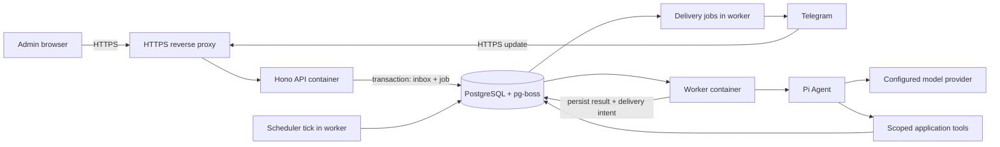

# Telegram bot implementation plan — Pi, Docker and admin panel

Date: 2026-09-18. Status: **ready to implement**. This plan incorporates the user's
choices of **Pi for AI**, **Docker for deployment**, and a **web admin panel**. Only the HTTP/Docker scaffold
exists today; unchecked work below remains planned.

## 1. First release and definition of done

Ship a bot that can join one explicitly connected group per workspace, answer
directed requests, produce a sourced team recap, save it as an approved recurring
workflow, and apply an approved correction to future runs. Support private onboarding,
shared instructions, status/cancellation, usage limits and data removal. A web admin
panel configures the bot and manages these capabilities in the first release.
First load provides admin creation and a resumable bot-setup wizard. Agent skills
can be created/imported, configured, tested and enabled from the panel.

Demonstration: first web visit → claim setup and create admin → configure bot, model,
whitelist and skills → activate → start bot → link group → authorize the desired context collection →
request recap → correct its format → approve Friday schedule → restart containers →
receive one scheduled recap using the corrected format → inspect it in the admin
panel → pause it from the panel successfully.

P0 supports text and message references. External app connectors, uploaded-file
processing, proactive suggestions, arbitrary browsing, shell access, payments and a
Mini App follow the pilot. The existing [requirements](../design/product-requirements.md)
remain the product contract; this document determines implementation order.

## 2. Technical decisions

| Area | Decision | Reason |
| --- | --- | --- |
| Language/tooling | TypeScript strict, Bun packages/build/tests, Biome | Retain the existing toolchain. |
| Runtime | Node 24 in Docker | Conventional server lifecycle and Pi's declared Node requirement. |
| HTTP | Hono plus `@hono/node-server` | Keep the current app and add a server entry point. |
| Admin UI | React Router 7 SPA, Tailwind/shadcn as needed | Serve built assets with Hono; one origin and Docker image. |
| Agent | Pi `Agent` from `pi-agent-core`; providers through `pi-ai` | Tool loop, events and model abstraction without embedding a coding CLI. |
| Persistent state | PostgreSQL | Transactions across workspace state, inbox, approvals and jobs. |
| Background work | pg-boss on the same PostgreSQL instance | Durable jobs and retries without an additional Redis service. |
| Scheduling | Persist our workflow recurrence/next occurrence; periodic worker dispatch | Product-visible timezone, version and missed-run semantics remain explicit. |
| Deployment | Docker Compose: API, worker, PostgreSQL; HTTPS proxy at the host boundary | One small-host deployment, independently restartable API and executor. |
| Files | Defer storage service until file features | No R2 dependency; later use a private persistent volume or S3-compatible store. |
| Models | One configurable provider/model initially | Select from Pi-supported tool models using our recap/tool evaluation. |

Pi upstream currently names packages `@earendil-works/pi-agent-core` and
`@earendil-works/pi-ai`; older examples use `@mariozechner`. The reviewed upstream
manifests declare version 0.85.1 and Node >=22.19.0. Verify the actual published
release, pin compatible versions together, and code against that release rather than
mixing examples from both generations. [Pi packages](https://github.com/earendil-works/pi),
[runtime manifest](https://github.com/earendil-works/pi/blob/main/packages/agent/package.json)

The `Agent` API exposes tools, context transformation, event subscriptions and abort.
Our application will own durable sessions and product policy around it. Do not
import the coding-agent CLI, shell tools or Node SQLite session backend merely to
obtain chat behavior. [Pi Agent documentation](https://github.com/earendil-works/pi/blob/main/packages/agent/README.md)

pg-boss documents transactional enqueue, retries and PostgreSQL-backed workers. Its
queue guarantees do not make a Telegram send or a model request exactly once; we
still need application idempotency and ambiguous-outcome handling.
[pg-boss documentation](https://github.com/timgit/pg-boss#readme)

## 3. Runtime structure



API and worker use the same image with different entry points. Only API receives
webhook traffic. PostgreSQL is private to the Compose network. Multiple workers may
eventually run, so database constraints and leases enforce correctness from day one.
No process-local map is the authoritative store for conversations or pending work.

Planned files, added only when each slice needs them:

```text
src/app.ts                      HTTP routes, dependency injection
src/server.ts                   Node HTTP lifecycle
src/worker.ts                   job handlers, scheduler, shutdown
src/config.ts                   runtime configuration validation
src/telegram/{webhook,client,router,render}.ts
src/db/{pool,migrate,repositories}.ts
src/jobs/{queue,dispatch,delivery}.ts
src/workspaces/{service,policy}.ts
src/agent/{runtime,context,events,limits}.ts
src/agent/tools/                bounded application tools
src/workflows/{service,schedule,approvals}.ts
src/memory/service.ts
src/usage/service.ts
src/privacy/service.ts
src/admin/{auth,routes,schemas}.ts
src/setup/{claim,service,credentials}.ts
src/skills/{catalog,loader,policy}.ts
web/                            React Router admin SPA
migrations/                    versioned SQL migrations
tests/{unit,integration,fixtures}/
```

Keep `src/index.ts` as the current app until splitting it actually helps. Repositories
take an explicit workspace/actor context; tool schemas never accept an unchecked
tenant ID as authority. Validate SQL using real PostgreSQL integration tests.

## 4. Implementation slices

### I01 — Pi compatibility and runtime contract

- [ ] Pin Pi packages and register one provider explicitly; avoid bundling every provider.
- [ ] Build a fake-stream Agent test: request → validated tool call → tool result → final output.
- [ ] Prove event ordering, abort propagation, turn limits and transcript restoration
  on the selected release in the Node Docker image.
- [ ] Define an `AgentRunner` boundary receiving actor, run ID, context, tool policy,
  budget and cancellation signal; returning result, usage and checkpoint events.
- [ ] Choose the initial provider/model after an opt-in credentialed evaluation;
  keep the normal tests independent of paid APIs.

Gate: fake-provider tool flow, bounded loop and cancellation pass in the production
runtime. Record the tested package versions and Node image with the result.

### I02 — Database, jobs and service lifecycle

- [ ] Add PostgreSQL, `pg` and pg-boss; use versioned SQL migrations initially.
- [ ] Create workspace/member/chat-binding, incoming-event and audit tables plus
  the job schema. Add runs/transcripts/delivery records in the following slices.
- [ ] Implement atomic inbox insertion + enqueue using the selected pg-boss
  transaction adapter. If that cannot be demonstrated, use a transactional outbox
  and a retryable dispatcher; never perform unprotected DB-write-then-enqueue.
- [ ] Add unique `(bot_id, update_id)` and active chat-binding constraints.
- [ ] Add worker process, retry/dead-letter policy, job leases and graceful draining.
- [ ] Add a one-shot migration command and Compose PostgreSQL volume. Run migrations
  once before starting services; do not let every replica race schema upgrades.

Gate: duplicate events dispatch one logical job; a crash after commit loses no work;
rollback leaves neither accepted event nor job. Container restart preserves state.

### I02A — First-run web shell and initial admin

- [ ] Create the React Router SPA shell and `/setup` route; fresh deployments redirect
  there, initialized deployments redirect to admin login/dashboard.
- [ ] Add deployment setup state, local admin account/password-hash records, sessions
  and a host command issuing a one-use expiring bootstrap token.
- [ ] Atomically consume the token and create one admin; protect against concurrent
  claims, public reinitialization and last-admin lockout. Add operator recovery.
- [ ] Add a resumable wizard and encrypted credential storage using a Docker runtime
  encryption key. Bot/model token fields are write-only; logs and responses are redacted.
- [ ] Wire bot checks/owner linking with I03–I04, model checks with I05, and skill
  selection with I07A. Until then, incomplete setup stays inactive.

Gate: setup can create an admin before a bot is configured, resume after restart,
reject a second claim and save encrypted settings. See [first-run setup](../design/first-run-setup.md).

### I03 — Real Telegram transport

- [ ] Add validated bot identity, token and webhook-secret configuration.
- [ ] Authenticate `POST /telegram/webhook`, cap body size, validate supported updates.
- [ ] Accept messages, callback queries and membership changes; safely acknowledge
  irrelevant supported-platform events without launching model work.
- [ ] Persist authorized event/job before 2xx; return failure on unavailable storage.
- [ ] Route `/start`, `/help`, addressed commands and replies; ignore other bots and
  commands addressed elsewhere. Treat edited messages as edits, not new requests.
- [ ] Implement Telegram client, formatting, topic-preserving replies and delivery
  jobs with rate handling, error classification and tracked remote message IDs.
- [ ] Add an idempotent webhook-registration script that inspects existing settings;
  run it only against the configured staging bot when deployment is ready.

Gate: a dedicated staging bot answers `/help`; forged requests are rejected; retrying
the update does not create another run; removed/blocked destinations stop retrying.

### I04 — Onboarding, access and useful context

- [ ] Private `/start` creates/selects workspace and confirms timezone.
- [ ] Implement short-lived one-use group-link tokens, with Telegram group-admin
  verification and independent workspace-admin verification.
- [ ] Add explicit member enrollment; linking a group does not make every Telegram
  sender a workspace admin. Reject ambiguous anonymous-admin identity for sensitive actions.
- [ ] Add a versioned workspace access policy and Telegram-ID whitelist, defaulting
  to whitelist-only. Seed the owner, deny empty lists and use one shared policy check
  for bot requests, callbacks, admin APIs, queued jobs and schedules. Implement effective
  revocation and last-admin recovery as defined in [access control](../design/access-control.md).
- [ ] Store chat/topic boundaries and available history coverage.
- [ ] Default to directed-message context. Add opt-in collection of received group
  messages for recaps after verifying bot visibility and recording admin consent.
- [ ] Apply basic retention from the first stored message; process membership changes,
  bot removal and group migration. Revalidate access for sensitive/queued operations.

Gate: one group cannot be claimed twice; non-admin linking fails; private context
never enters group responses; unlinked groups produce no agent jobs.

**Important scope clarification:** basic consented message collection is needed in
P0 for useful whole-group recaps. P1 “monitoring” adds proactive analysis and suggestions.
Without collection, a recap must clearly cover only directed messages. Do not wait
until P1 to resolve this data-availability dependency.

### I04A — Admin authentication and configuration foundation

- [ ] Expand the I02A web shell into the admin panel with shared API schemas. Serve
  `/admin`; keep `/api/admin` errors as JSON rather than SPA fallbacks.
- [ ] Extend local admin sessions with verified Telegram identity linking and optional
  Telegram web login after bot setup. Enforce separate operator/workspace privileges.
- [ ] Add workspace roles, per-request authorization, CSRF controls and audit records.
- [ ] Add overview, bot settings, model selection, group access and member screens.
  Permit operator-only write-only credential updates; show status without secret values.
- [ ] Add an Allowed users screen: mode selection, ID add/remove/search, bulk import
  preview, affected-work preview, optimistic save and audit history. Test removed
  users with existing sessions, pending approvals and scheduled work across containers.
- [ ] Add validated/versioned settings, stale-write conflict handling and effective
  version display. API and workers use the same durable configuration.
- [ ] Build frontend assets into the Docker app image and test deep-link routing.

Gate: unauthorized users cannot access configuration; admins cannot cross tenant
boundaries; setting changes persist across restart and are audited. Browser tests
cover save conflicts, expired sessions and secret redaction.

The full [admin panel specification](../design/admin-panel.md) defines screens,
permissions and API resource boundaries. Extend this foundation alongside I05–I08:
run/usage views with I05, workflow controls with I06, memory with I07, and retention,
audit and operational controls with I08. Those screens are required for the P0 gate.

### I05 — Pi-powered requests and manual recaps

- [ ] Persist run status, conversation identity and versioned Pi transcript envelopes.
  Key sessions by workspace + chat + topic/reply context, not by a shared global Agent.
- [ ] Build context from permitted, retained messages and approved instructions;
  include source IDs, date range and gaps. Enforce input size before model dispatch.
- [ ] Supply initial tools: `read_chat_context`, `read_instructions`,
  `propose_workflow` and `propose_instruction`. Proposal tools cannot activate changes.
- [ ] Use server-bound actor context and policy checks within every tool executor;
  configure sequential tool execution initially to simplify side-effect reasoning.
- [ ] Map Pi events to durable message/tool checkpoints and restrained progress
  updates. Do not persist or display hidden reasoning streams.
- [ ] Add `/ask`, `/status`, `/cancel`, manual recap rendering and source validation.
- [ ] Reserve workspace budget before calls; record provider/model usage and reconcile
  actual cost. Unknown/ambiguous charges remain reserved until reconciled.

Gate: fixtures cover source-grounded recaps, missing history, invalid tool arguments,
hostile message instructions, wrong tenant, budget exhaustion, provider failure and
cancellation. Any cited source must come from the authorized input set.

### I06 — Approvals and scheduled workflows

- [ ] Add versioned workflow definitions, approval records and unique occurrences.
- [ ] Parse natural language into a schema-validated proposal. P0 recurrence supports
  daily and weekly schedules; ask for clarification for unsupported recurrence.
- [ ] Preview timezone, next three runs, source/destination, owner, format and budget.
- [ ] Implement expiring, actor-bound approval buttons with payload/version hashes.
  Consume approval and activate the exact workflow version in one transaction.
- [ ] Implement `/automations`: inspect, run now, edit, pause, resume and delete.
- [ ] Scheduler tick claims `(workflow_id, scheduled_instant)` once, pins a version,
  rechecks authorization and creates a run using the same Pi execution path.
- [ ] Define DST: skip nonexistent local instants; run once at the earlier occurrence
  of repeated local instants. Preview and execution use the same calculation.
- [ ] Skip occurrences over five minutes late in the pilot and notify the owner;
  store the threshold as policy. Never backfill a burst silently.

Gate: two workers/two approval clicks create one logical occurrence; rejected and
paused workflows do not run; owner removal blocks execution; DST fixtures pass.

### I07 — Corrections and shared instructions

- [ ] Reply to a run with a correction; offer this-run-only or save-to-workflow.
- [ ] Save approved instructions with author, scope, provenance and version.
- [ ] Add `/memory` list/edit/forget and admin-controlled workspace instructions.
- [ ] Resolve conflicts explicitly; prevent personal instructions from being promoted
  to team scope without approval. Existing runs retain their starting instruction version.
- [ ] Add history linking outputs to workflow and instruction versions.

Gate: next run uses the saved correction; a teammate can reuse shared conventions;
forgetting an instruction removes it from future context; private memory stays private.

### I07A — Web-managed agent skills

- [ ] Add versioned skill catalog/assignments, Markdown validation, settings schemas
  and scoped runtime loading into Pi. Begin with the recap and follow-up draft templates.
- [ ] Build catalog, editor/import, preview, test, publish, enable/disable and rollback UI.
- [ ] Enforce declared-tool requirements against actual actor/workspace/tool permissions;
  imported metadata cannot grant capabilities. P0 accepts instruction Markdown only.
- [ ] Pin skill versions per workflow/run and display dependent schedules before changes.
- [ ] Add wizard skill selection and dependency validation before activation.

Gate: an admin can publish a skill, see it used by a Telegram run and disable dependent
execution. Cross-tenant loading, unsafe tool requests and implicit writes fail tests.
See [agent skill requirements](../design/agent-skills.md).

### I08 — Pilot operations and removal

- [ ] Add `/usage`, `/settings`, `/privacy` and admin controls required by P0.
- [ ] Add cancellation checks between model/tool steps and before publication.
- [ ] Implement deletion tombstones, queue cancellation, retention sweeps and purge
  status across raw messages, transcripts, instructions and provider-held state.
- [ ] Add readiness separate from liveness, worker heartbeat, queue-age/failure metrics,
  structured redacted logs and operator pause/retry tools.
- [ ] Add CI checks, image build/smoke test, migration tests, backup/restore rehearsal
  and a release runbook. Pin release images by digest.
- [ ] Deploy to a Docker host behind HTTPS; configure runtime secrets, then register
  the staging webhook. Exercise the full demonstration before inviting pilot teams.

Gate: restart, revoked-access, deletion and restore drills pass. No accepted run is
silently lost. Support can diagnose by run ID without browsing raw user messages.

## 5. Critical behavior contracts

**Execution versus delivery:** a generated answer is not yet a delivered answer.
Track separate run and delivery status. Publish through recorded delivery intents;
never give the model unrestricted `sendMessage(chat_id, text)` access.

**Crash recovery:** persist completed model messages and tool outcomes. Record each
tool invocation under a stable run/tool-call ID before effectful execution. Resume
only from valid transcript boundaries; reconcile an unfinished tool call before
continuing. Do not assume `Agent.continue()` can recover arbitrary partial state.

**Approvals:** stop a run awaiting approval and release the worker. A callback
validates identity and version, then enqueues continuation. Do not keep an in-memory
Promise waiting for a human. Limit parallel proposals so no mixed tool batch can
continue an unapproved action.

**Concurrency:** use a database-backed conversation lease and fencing/version token.
Expired workers cannot overwrite a newer run. Unrelated topics can execute concurrently;
messages for a busy conversation queue. Pi steering is optional later, not a durability
mechanism. Cancellation is persisted so it works across containers.

**Budget:** reserve bounded input/output cost per call and enforce a maximum turn,
tool and wall-time budget. Initial conservative caps are configuration, tested in
I01/I05. Retry attempts may incur additional provider cost and need their own records.

**Ambiguous Telegram sends:** a network timeout can occur after Telegram accepted a
message. Record `delivery_unknown`, avoid blind resend, and expose recovery; neither
PostgreSQL nor the queue can guarantee exactly-once remote effects.

## 6. Order, effort and prerequisites

Critical path: I01 → I02 → I02A → I03 → I04 → I04A → I05 → I06 → I07 → I07A → I08. Domain fixtures may
be prepared early, but every slice must end with a runnable, reviewable result.

Rough planning estimate for one experienced engineer: **35–60 engineering days**
for a pilot-ready bot, onboarding wizard, skills manager and admin panel, including browser, integration and recovery
tests; then a two-week pilot.
This is an estimate, not a delivery commitment. Provider evaluation, OAuth/connectors
and infrastructure procurement are outside that estimate.

| Needed by | Input or decision | Default until supplied |
| --- | --- | --- |
| I01 live evaluation / I05 | Model provider account, API key and spend cap | Fake provider for deterministic tests; no paid calls. |
| I02A | Database, runtime encryption key and host access for initial claim | Local setup fixtures; no default admin password. |
| I03 staging check | Dedicated BotFather bot/token, supplied through setup, and test group | Local fixtures and fake Telegram transport. |
| I04 | Workspace timezone, enrollment and chat-capture consent | Ask during onboarding; directed context only. |
| I04A staging / I08 | Docker host, DNS name, Telegram login domain, HTTPS, secret/backup storage | Local Compose and fake login fixtures only. |
| Pilot launch | Retention/purge target and operator support owner | Proposed PRD defaults; explicitly finalize before storing pilot data. |

No provider credentials are needed to start I01's fake-stream integration or I02.
No deployment, account connection or real message sending is part of writing this plan.

## 7. After P0

1. Add one read-only connector based on pilot demand: GitHub PR summaries or Google
   Drive source documents. Keep connection owner and permitted audience explicit.
2. Add multi-chat workspaces, files, follow-up queues and blocker digests.
3. Add opt-in proactive suggestions with rejection memory and notification limits.
4. Extend P0 instruction skills with reviewed reference/script bundles and approved
   external writes only with tool-specific isolation and recovery tests.
5. Optionally embed the existing admin panel as a Mini App; add voice and payments
   only after usage justifies them.

Update [roadmap](roadmap.md), [architecture](../design/architecture.md) and the user
guide after each completed slice. Keep proposed features visibly separate from shipping ones.
